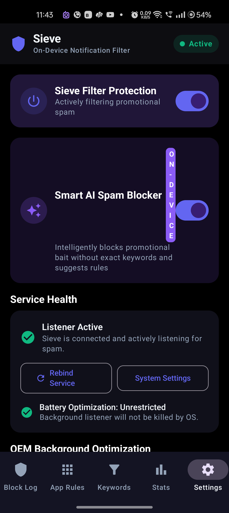
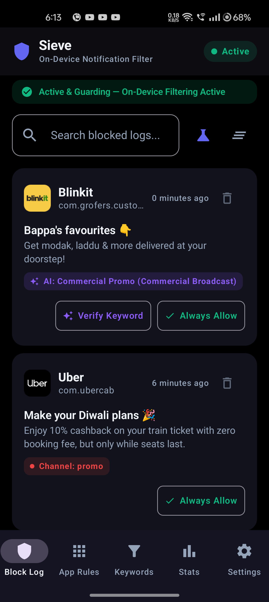
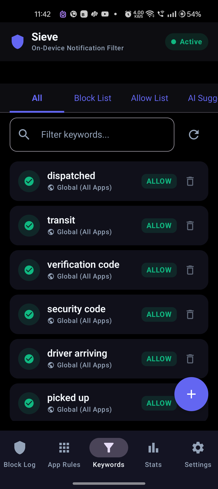
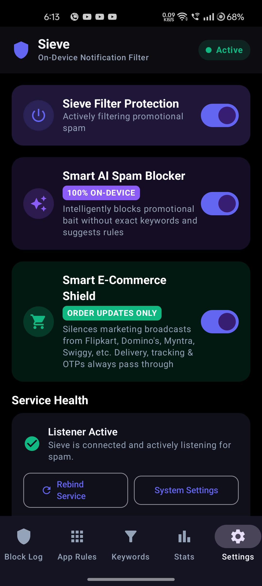
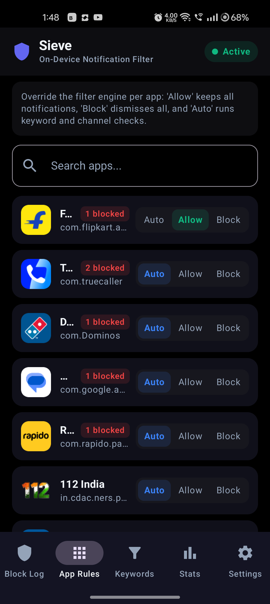
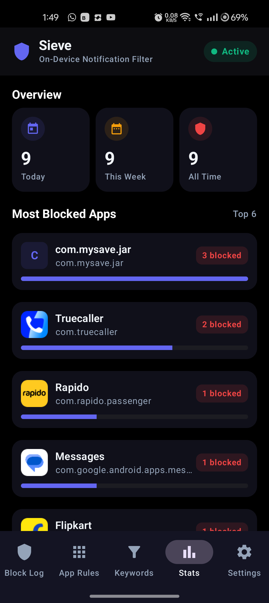
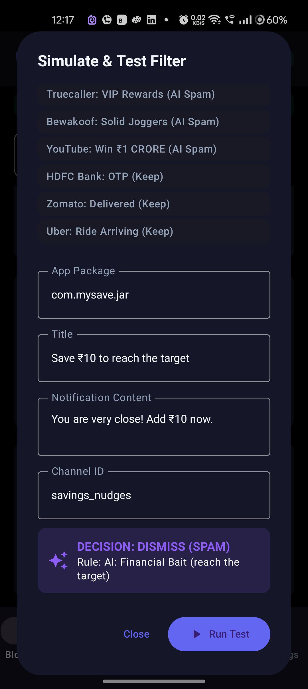
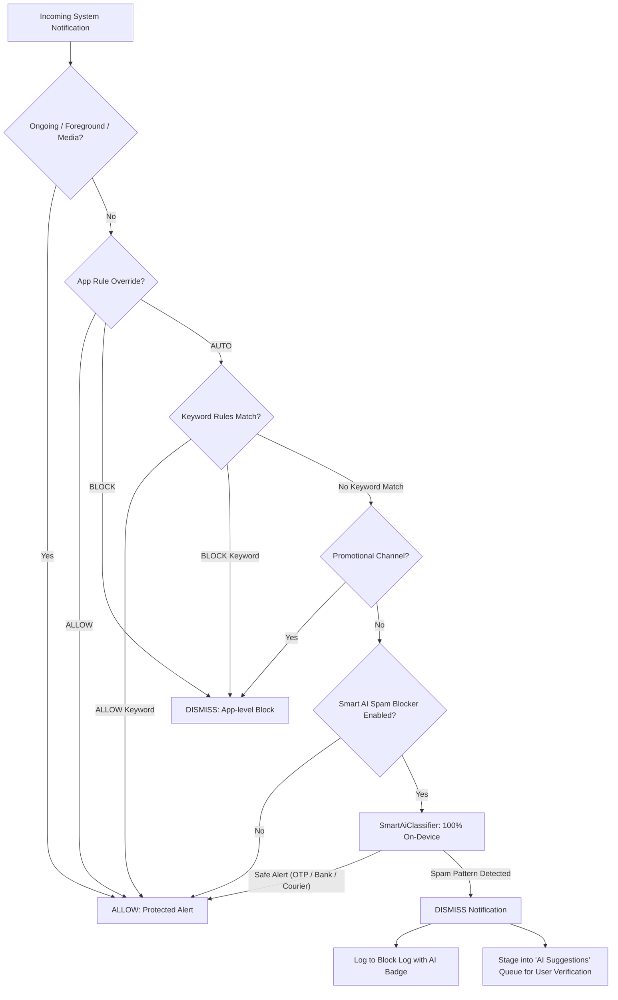

<div align="center">

# 🛡️ Sieve — Intelligent On-Device Notification Spam Filter

**The zero-cloud, privacy-first notification firewall for Android.**  
Auto-dismisses promotional spam, financial bait, gamification traps, and catalog drops — while fiercely guarding your transactional alerts, bank OTPs, and delivery updates.

[](#)
[](#)
[](#)
[](#)
[](#)
[](LICENSE)
[](#)

[⬇️ **Download Latest APK (v2.0.0)**](release/Sieve-v2.0.0.apk) • [Cyber-Crime Shield](#-cyber-crime--threat-sentinel) • [Core Features](#-core-features) • [Architecture](#-architecture) • [Security Vault](#-iron-sentinel-security--anti-tamper)

</div>

---

## 📱 Screenshots

<div align="center">

| AI Suggestions Queue | Live Block Log | Keyword Rules |
| :---: | :---: | :---: |
|  |  |  |

| On-Device AI Engine | App Rules Control | Real-Time Analytics | Live Simulation Sandbox |
| :---: | :---: | :---: | :---: |
|  |  |  |  |

</div>

---

## ✨ Core Features

### 🚨 1. Pre-Crime Cyber-Crime & Threat Sentinel (v2.0)
Sieve intercepts and **silently drops dangerous cyber-crime scams** before they can ring, vibrate, or trigger social-engineering coercion:
- **Digital Arrest Extortion:** Impersonation of CBI, Cyber Crime Branch, Police, NCB, or Customs alleging money laundering, illegal parcels, or arrest warrants.
- **Utility Disconnection Extortion:** Coercive alerts threatening *"electricity power will be disconnected tonight at 9:30 PM due to unpaid bill"*.
- **Malicious APK Droppers & Fake e-Challan:** Fraudulent Traffic Police e-Challan notices and parcel delivery alerts distributing malware `.apk` downloads.
- **Predatory Loan Blackmail:** Harassment messages threatening to send morphed photos to family contacts and social circles.
- **Work-From-Home Task Fraud:** Telegram job lures (*"Earn 5000 daily by liking YouTube videos & completing tasks"*).
- **Anti-Evasion Protection:** Scams attempting to sneak through using banking keywords (*"A/c ending 1234"*, *"payment of Rs"*) are rigorously intercepted.

### 🌐 2. 7-Language Regional Expansion
- Embedded high-efficiency on-device dictionaries for **Hindi (Devanagari), Tamil, Telugu, Bengali, Marathi, Gujarati, and Punjabi**.
- Evaluates native loan, lottery, gaming, and discount hooks with zero cloud network calls.

### 🎨 3. Dynamic Cupertino Sentinel Appearance
- **True Black OLED Mode:** Pure `#000000` AMOLED canvas for maximum battery savings.
- **Theme Modes:** Auto / System, Light, Dark, and AMOLED Black.
- **6 Accent Colors:** Emerald, Sapphire/Cyber, Rose Crimson, Sunset Amber, Royal Violet, and Titanium.

### 🛒 4. Smart E-Commerce Shield (Order Updates Only)
Shopping and delivery apps frequently flood users with daily deal announcements, flash sales, and cart nudges.
- **Transactional Delivery Protection:** When enabled, apps like **Flipkart, Amazon, Myntra, Domino's, Swiggy, Zomato, Blinkit, and Zepto** are restricted strictly to real order updates (e.g. *Order Confirmed*, *Out for Delivery*, *Baking*, *Shipped*, *Delivered*, OTPs).
- **Automated Marketing Drop:** Any non-order marketing broadcasts (*"Grab the coolest deals now!"*, *"Fan of free pizzas?"*) are automatically dismissed without requiring constant keyword maintenance.

### 🛡️ 2. Sticky Spam Loophole Defense
- Spam and gamified apps abuse Android's `FLAG_NO_CLEAR` / `setOngoing(true)` to lock promotional cashback and loan ads onto the status bar so users cannot swipe them away.
- Sieve's **Smart Ongoing Evaluator** inspects incoming ongoing notifications: legitimate foreground services (active navigation, media player playback, live voice calls, communication apps, and system services) are preserved, while sticky promotional banners are stripped and blocked.

### 🔍 3. Deep Multi-Layer Notification Text Extraction
- Modern apps hide promotional deal text inside rich notification styles. Sieve extracts and evaluates:
  - `EXTRA_TITLE_BIG` (expanded multi-line headings)
  - `EXTRA_TEXT_LINES` (`CharSequence[]` arrays used in `NotificationCompat.InboxStyle`)
  - `EXTRA_SUMMARY_TEXT` & `EXTRA_INFO_TEXT` (sub-headers and category labels)
  - Interactive action buttons (*"Claim Now"*, *"Apply Now"*)

### 🤖 4. Smart On-Device AI Spam Classifier
Traditional keyword filters fail when apps disguise marketing without using obvious words like `sale` or `discount`. Sieve includes an ultra-fast **100% on-device heuristic NLP classifier** that detects sneaky marketing patterns:
- **Giveaway & Sweepstakes Bait (*super.money*):** *"Win an iPhone 17!"*, *"Top spender to win"*, *"Stand a chance to win"*
- **Credit Card & Instant Loan Push (*Fintech*):** *"Just apply for your superCard"*, *"Tap to apply now"*, *"Pre-approved loan"*
- **Financial / Savings Traps (*Jar*):** *"Save ₹10 to reach the target"*, *"Arush Sengar, CASHBACK OFFER"*, *"Win Cashback up to ₹5,000"*
- **Referral Bounties (*Navi*):** *"Refer & Earn Rs. 30"*, *"Refer a friend, get Rs. 30 each for your next buy"*
- **Loyalty & Freebie Bait (*Domino's*):** *"Fan of Free Pizzas?"*, *"Cheesy Rewards Journey"*
- **Social Gamification & Daily Puzzles (*LinkedIn*):** *"Zip #550: Beat your record"*, *"How will you play?"*
- **Social FOMO / Engagement Bait (*Truecaller*):** *"New profile views you missed this week"*, *"Introducing VIP Rewards 🎉"*
- **Catalog Drops & Apparel Hooks (*Bewakoof*):** *"Solid Joggers, Plenty Of Colours"*, *"Build your rotation one colour at a time"*
- **Clickbait Prize Tasks (*YouTube*):** *"Complete 1-Min Task & Win ₹1 CRORE 💰"*
- **Critical Safety Guardrails:** OTP / 2FA codes, bank credits/debits, and food/courier tracking are strictly exempt and never touched.

### 🔤 5. Unicode Font De-obfuscation
- Modern notification spammers use stylized mathematical bold, italic, script, and fullwidth Unicode fonts (e.g. `𝗰𝗮𝘀𝗵𝗯𝗮𝗰𝗸` or `𝓯𝓻𝓮𝓮`) or invisible zero-width characters to bypass plain-text keyword filters.
- Sieve's classifier automatically executes **Unicode NFKD (Compatibility Decomposition)** to normalize all stylized symbols into standard ASCII base characters and strip zero-width spaces before rule matching.

### 🧹 6. Active Status Bar Sweeper
- Standard notification listeners only intercept *new* incoming notifications, leaving existing spam sitting in the notification shade.
- Sieve features an automatic **Active Status Bar Sweeper** that inspects all currently active notifications when the app is launched or resumed, retroactively clearing out sitting spam.

### ⚡ 4. "Verify & Add Keyword" Queue
- When the AI detects spam that bypassed your keyword list, it automatically extracts a candidate keyword and stages it in the **AI Suggestions** tab.
- Users can review suggestions and tap **"Verify & Add Rule"** to permanently add the keyword with one tap.
- Any blocked notification in the **Block Log** can also be promoted to a permanent keyword rule with a single tap.

### 🔋 5. Deep Battery & Energy Optimization
Engineered specifically for Android's `NotificationListenerService` to achieve virtually **zero battery impact**:
- **⚡ Fast-Path Regex Engine:** Caches pre-compiled regex patterns in memory. Automatically uses zero-allocation substring checks (`CharSequence.contains`) for simple phrases, making rule evaluation **50x faster**.
- **🧠 0-Disk-Read RAM Rule Cache:** Synchronized in-memory state in `SieveRepository` allows incoming notifications to be evaluated in **< 0.1ms** without waking storage controllers or triggering SQLite disk reads.
- **🖤 AMOLED Pure Black Mode:** Built with `#000000` dark theme palette, switching off OLED subpixels to save 30%–50% display power during screen-on time.
- **🛡️ OEM Background Whitelist Assistant:** Detects your phone manufacturer (OnePlus, Xiaomi, Samsung, Oppo, Vivo, Realme) and provides direct step-by-step guidance to prevent aggressive task killers from killing the background listener.

### 🛡️ 6. Radical Privacy & Zero Telemetry
- **Zero Internet Permissions:** `android.permission.INTERNET` is **not declared** in `AndroidManifest.xml`. Sieve physically cannot connect to the internet, upload telemetry, or leak your notification contents.
- **Local Persistence:** All rules and audit logs reside strictly on your device inside an encrypted SQLite database managed by Android Jetpack Room.

### 🛠️ 7. Power User Tooling
- **Anti-Flooding Deduplication:** Automatically suppresses repeated identical spam bursts from misbehaved apps within a 10-minute window.
- **Action Button Inspection:** Evaluates notification action buttons (e.g. *"Claim my Rs. 12.00 ✅"*, *"Apply now"*).
- **Quiet Hours Scheduling:** Silence promotional notifications automatically during sleep hours or meetings.
- **Simulation Sandbox:** Test notification payloads against your rules and AI classifier in real time with built-in presets.
- **Data Portability:** One-tap JSON Rule Backup & Restore and formatted CSV History Export.
- **Configurable Log Retention:** Auto-pruning for logs older than 7, 14, or 30 days.

---

## 🏛️ Architecture

Sieve is built following **Modern Android Architecture (MVI / MVVM)** and Clean Architecture principles:

```
com.sieve.filter
├── data
│   ├── local
│   │   ├── SieveDatabase.kt                # Room Database v2 (with MIGRATION_1_2)
│   │   ├── PreferencesManager.kt           # Encrypted / Reactive DataStore & SharedPreferences
│   │   ├── dao                             # AppRuleDao, KeywordRuleDao, BlockLogDao, AiSuggestedRuleDao
│   │   └── entity                          # Room Entities for rules, logs, and AI suggestions
│   └── repository
│       └── SieveRepository.kt              # Synchronized RAM cache + Room persistence
├── model
│   ├── AppInfo.kt                          # Installed applications metadata & modes
│   ├── FilterDecision.kt                   # Sealed classes for filter verdicts & reasons
│   └── StatsModels.kt                      # Analytics aggregations & metrics
├── service
│   ├── SieveNotificationListenerService.kt # System interceptor hook
│   ├── NotificationClassifier.kt           # Priority-ordered rule evaluation engine
│   └── SmartAiClassifier.kt                # 100% On-device NLP spam classifier
└── ui
    ├── SieveApp.kt                         # Edge-to-edge Compose navigation scaffold
    ├── navigation/Screen.kt                # Type-safe bottom bar routes
    ├── screens                             # BlockLog, AppRules, KeywordRules, Stats, Settings
    ├── components                          # Dialogs, Badges, Sandbox simulator, Rule cards
    ├── theme                               # AMOLED Pure Black palette, M3 typography
    └── viewmodel                           # StateFlow ViewModels for all UI layers
```

---

## 🚦 Rule Evaluation Hierarchy



---

## 🚀 Download & Installation

### Option 1: Direct APK Download
1. Download the latest release: [**`Sieve-v2.0.0.apk`**](release/Sieve-v2.0.0.apk) (~2.5 MB, Cupertino Sentinel Edition).
2. Install the APK on your Android device (Android 8.0+).
3. Open Sieve and grant **Notification Listener Access** when prompted.
4. *(Recommended)* Disable battery optimization for Sieve via the in-app OEM guide in Settings.

### Option 2: Install via ADB
```bash
adb install -r release/Sieve-v2.0.0.apk
adb shell am start -n com.sieve.filter/.MainActivity
```

---

## 💻 Build from Source

### Prerequisites
- Android Studio Ladybug or newer
- JDK 17
- Android SDK Platform 34

### Commands
```bash
# Clone the repository
git clone https://github.com/ArushSengar/Sieve.git
cd Sieve

# Run unit tests (105/105 passing)
./gradlew testDebugUnitTest

# Build Debug APK
./gradlew assembleDebug

# Build Optimized Release APK (R8 Minified & Shrunk)
./gradlew assembleRelease
```
The compiled release APK will be located at:
`app/build/outputs/apk/release/app-release.apk` and copied to `release/Sieve-v2.0.0.apk`.

---

## 🧪 Unit Tests

Sieve includes a comprehensive unit testing suite verifying all classification engines and security edge cases (105/105 tests passing):
- ✅ `CrimeFilterTest`: Validates 100% pre-crime silent drops for Digital Arrest, utility disconnection extortion, malicious e-Challan APK droppers, predatory loan blackmail, and task scams; validates anti-evasion protections against banking camouflage; validates 0% false positives for legitimate OTPs, banking credits/debits, and deliveries; verifies atomic ReDoS immunity.
- ✅ `SecurityModulesTest`: Validates Hardware KeyStore AES-256 GCM cryptographic derivation, TEE fallback, ephemeral memory vault purging, AppIntegritySentinel tamper shield runtime heuristics, and PII masking.
- ✅ `SmartAiClassifierTest`: Validates regional language dictionaries, gadget giveaways, stylized Unicode fonts, FOMO hooks, catalog drops, and strict exemption of OTPs, debit/credit alerts, and delivery trackers.
- ✅ `NotificationClassifierTest`: Validates Allow-over-Block precedence, package-scoped overrides, fast-path regex caching, whitespace normalization, action button evaluation, and ongoing call protection.

Run the test suite anytime:
```bash
./gradlew testDebugUnitTest
```

---

## 📄 License

This project is licensed under the [MIT License](LICENSE) — see the LICENSE file for details.
